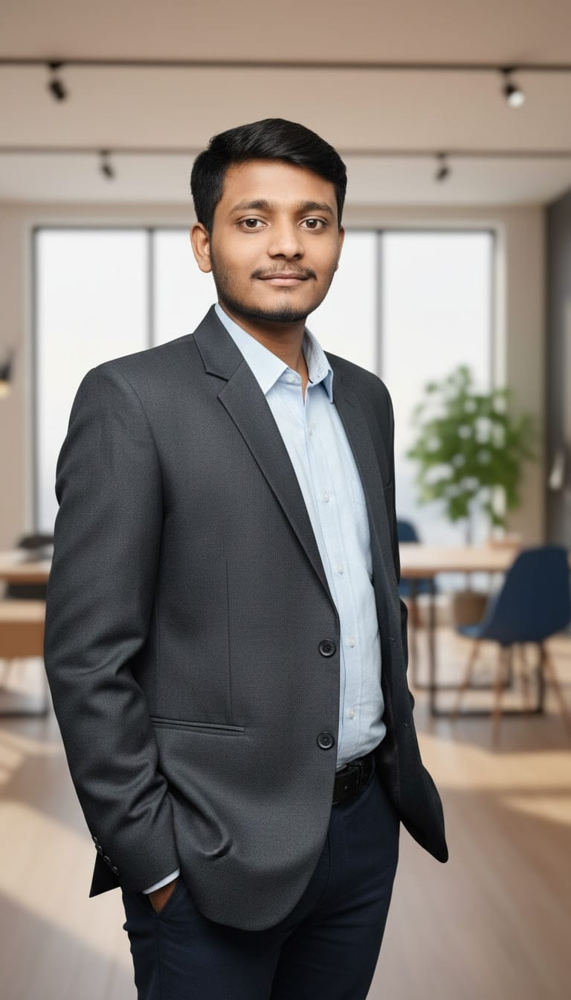

# SIDDARTHASWAMY U M
### Aspiring Information Science Engineer | RVCE Bangalore

---

## 📖 About Me
I am a driven **Information Science and Engineering** student at [RV College of Engineering (RVCE)](https://rvce.edu.in/), Bengaluru, with a strong foundation in problem-solving and system analysis. 

My academic journey began with a high distinction in my Diploma, where I secured a **DCET rank of 92**, fueling my transition into advanced engineering. I am passionate about building scalable, efficient systems and am currently deepening my expertise in **Data Structures, AI, and Cloud Architectures**. 

Beyond the classroom, I apply my technical curiosity as a part-time contributor at **EMBERQUEST Pvt. Ltd.**, where I gain hands-on industry experience.

---

## 🎓 Education

### **B.E. in Information Science and Engineering** (Ongoing)
**College:** [RV College of Engineering (RVCE)](https://rvce.edu.in/), Bengaluru  
**Status:** Successfully completed 3/8 semesters; currently in Semester 4 (Core Engineering Phase).  
**Notable Coursework:**
* Data Structures & Algorithms (DSA)
* Operating Systems (OS)

### **Diploma in Computer Science**
**College:** [DVS Polytechnic](https://www.dvsinstitutions.com/dvs+polytechnic.html), Shivamogga  
**Achievement:** Secured an All-State **DCET Rank of 92** (Top 0.1%).  
**Core Competencies:** Built a robust technical foundation in **Core Java, Python, and SQL**.  
**Foundation Excellence:** Mastered the pillars of computing, including OS, Computer Networks (CN), and Web Technologies (HTML/CSS).

---

## 🛠 Skills

| Category | Skills |
| :--- | :--- |
| **Programming** | Java, Python, C, JavaScript |
| **Core Engineering** | Data Structures & Algorithms (DSA), System Analysis & Design, Computer Networking |
| **Tools & Platforms** | Git/GitHub, VS Code, Cloud (AWS/Azure) Basics, ML Frameworks |
| **Professional** | Problem-solving, Technical Documentation, Collaborative Teamwork |

---

## 📬 Contact & Connect

* 📍 **Location:** Bengaluru, Karnataka (Open to relocation)
* 📧 **Email:** [siddarthaswamy.um77@gmail.com](mailto:siddarthaswamy.um77@gmail.com) — *Available for internship opportunities*
* 🔗 **LinkedIn:** [SIDDARTHASWAMY-UM](https://www.linkedin.com/public-profile/settings?lipi=urn%3Ali%3Apage%3Ad_flagship3_profile_self_edit_contact-info%3BJOI%2B6Wg8ST6QzSS0B9or1w%3D%3D)
* 💻 **GitHub:** [siddarthaswamyum-77](https://github.com/siddarthaswamyum-77/SIDDARTHASWAMY-UM-Portfolio)